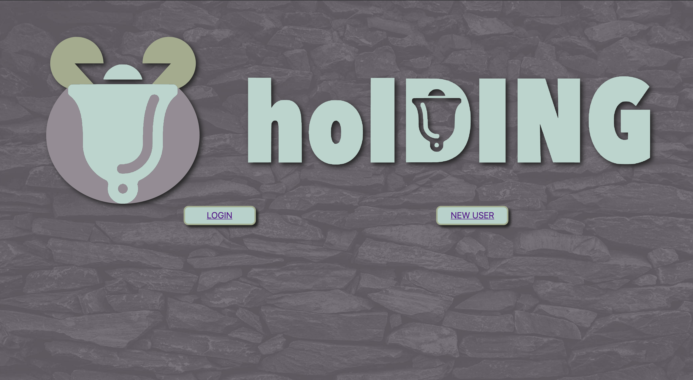

# Holding: Reactified (full-stack web application)

*holDING is a massive social network consisting of micro social networks intersecting at the users, for the users.*

## Developers
+ [Douglas MacKrell](https://github.com/DouglasMacKrell)
+ [Briahana Maugé](https://github.com/Briahana-Mauge)
+ [Joseph P. Pasaoa](https://github.com/joseph-p-pasaoa)
+ [Kathy Puma](https://github.com/KathyPuma)

### Roles
+ Tech Lead, Project Manager, Head of UI/UX, PR Review Chief

### Tech
+ PostgreSQL
+ Express.js
+ Node.js
+ JavaScript / ECMAScript 6
+ HTML5
+ CSS3
+ CORS
+ Pg-Promise
+ Axios
+ Git / Github
+ Trello
